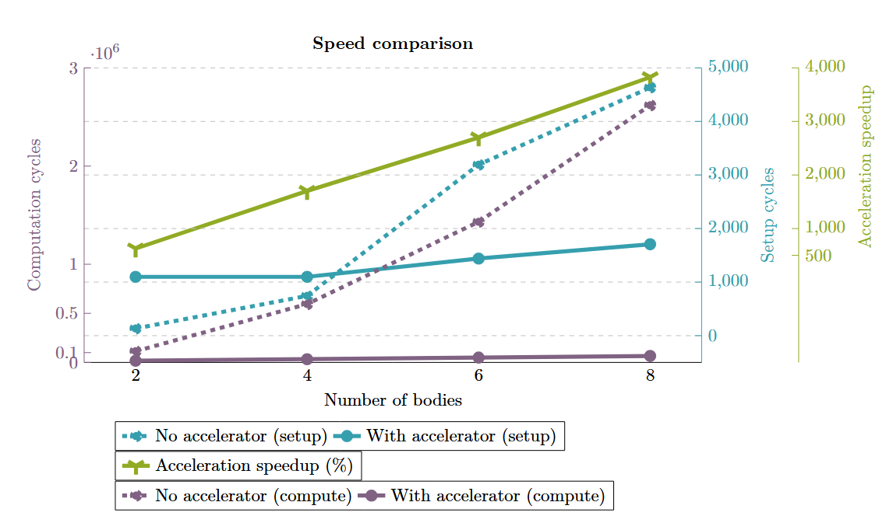

# Fast Negative Three-Half Exponent

As detailed in the body processing unit's documentation, the velocity update flow relies on computing $$x^{-3/2}$$. While it would be possible to implement the fast inverse square root algorithm (which computes $$x^{-1/2}$$) and then cube the result, a custom algorithm dedicated to $$x^{-3/2}$$ can yield better results, depending on the precision requirements.

This document first explains the well-known fast inverse square root algorithm, details the custom fast negative three-half exponent algorithm, and then compares the two methods in terms of precision and clock cycles necessary.

## The Fast Inverse Square Root Algorithm

The fast inverse square root algorithm is a well-known method for approximating $$y = 1/\sqrt(x)$$.

### Initial Estimate

Interpreting the bit representation of a positive IEE-754 floating point number $$x=(1+ \frac{M_x}{N} ) \cdot 2^{E_x-B}$$ as an integer thus results in: 
$$ \label{fAsInt}
	I_x = E_x \cdot N + M_x
$$
Where $$I_x$$ is the float interpreted as an integer, $E_x$ is the exponent of the floating point number, N is $$2^{23}$$ and $$M_x$$ is the mantissa. 

When looking for the inverse square root \cite{fInvRoot}: \\

$$
y=\frac{1}{\sqrt{x}}
$$

$$
\leftrightarrow \log_2(y) = -\frac{1}{2} \log_2(x)
$$

$$
\leftrightarrow \log_2\left((1 + \frac{M_y}{N}) \cdot 2^{E_y - B}\right) = -\frac{1}{2} \log_2\left((1 + \frac{M_x}{N}) \cdot 2^{E_x - B}\right)
$$

$$
\leftrightarrow \log_2(1 + \frac{M_y}{N}) + E_y - B = -\frac{1}{2} (\log_2(1 + \frac{M_x}{N}) + E_x - B)
$$

$$
\leftrightarrow \log_2(1 + \frac{M_y}{N}) + E_y = -\frac{1}{2} (\log_2(1 + \frac{M_x}{N}) + E_x) + \frac{3B}{2}
$$

Using the first order Taylor approximation, $$\log_2(1 + x) \approx x$$. For $$x$$ in $$[0, 1)$$, the overall error can be reduced by adding a bias term (see [1]):

$$
\log_2(1 + x) \approx x + \sigma
$$

To minimize the total error, `σ = 0.057304...`. This computation is detailed in [1].

> **Note:** Adding a small offset to the first order Taylor approximation allows for a closer fit in the range $$[0, 1)$$. While the absolute value of the error is higher at the end than at the start with the offset, the overall error is lower with the offset.

$$M_y/N$$ is in the range $$[0, 1)$$. Thus, the approximation can be injected into the previous equation yields:

$$
\frac{M_y}{N} + \sigma + E_y \approx -\frac{1}{2} (\frac{M_x}{N} + \sigma + E_x) + \frac{3B}{2}
$$

Or, grouping terms:

$$
\frac{M_y}{N} + E_y + \sigma \approx -\frac{1}{2} (\frac{M_x}{N} + E_x + \sigma) + \frac{3B}{2}
$$

$$
M_y + E_y N + N \sigma \approx -\frac{1}{2} (M_x + E_x N + N \sigma) + N \frac{3B}{2}
$$

$$
I_y + N \sigma \approx -\frac{1}{2} (I_x + N \sigma) + N \frac{3B}{2}
$$

$$
I_y \approx \frac{3N}{2} (B - \sigma) - \frac{I_x}{2}
$$

The term $$\frac{3N}{2} (B - \sigma)$$, often referred to as the "magic number", can take different values depending on the value of $$\sigma$$ used. For $$\sigma = 0.057304$$, $$\frac{3N}{2} (B - \sigma) = 1.5973087728 \times 10^9 = 0x5F34FF64$$.

Which yields:

$$
I_y \approx 0x5F34FF64 - (I_x \gg 1)
$$

Using this formula for the magic number yields the following result:

### Refining the Estimate

As shown in the last section, while the estimate has an overall good fit (with a relative error of around 4% in the worst cases), it can still be improved. To do so, the Newton-Raphson method is traditionally used [2]. The idea is to create a function that takes the estimate as input and has roots only where the estimate has the correct value, then use the Newton-Raphson method to refine the estimate of the root's position.

This is traditionally done as follows:

$$
f(y) = \frac{1}{y^2} - x
$$

$$
f'(y) = -\frac{2}{y^3}
$$

$$
y_{n+1} = y_n - \frac{f(y_n)}{f'(y_n)} = y_n - \frac{\frac{1}{y_n^2} - x}{-\frac{2}{y_n^3}} = y_n + \frac{y_n}{2} - x y_n^3 = y_n \left(\frac{3}{2} - x y_n^2\right)
$$

The results using this formula for one and two iterations of the refinement are shown below:

## References

1. McEniry, C. (2007). *The mathematics behind the fast inverse square root function code*.
2. Moroz, L. V., Walczyk, C. J., Hrynchyshyn, A., Holimath, V., & Cieśliński, J. L. (2018). Fast calculation of inverse square root with the use of magic constant – analytical approach. *Applied mathematics and computation*, 316, 245-255.