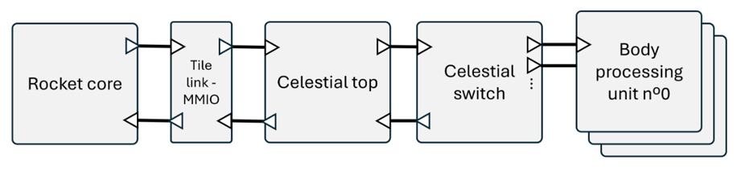

# Fast Negative Three-Half Exponent

As detailed in the body processing unit's documentation, the velocity update flow relies on computing `x^{-3/2}`. While it would be possible to implement the fast inverse square root algorithm (which computes `x^{-1/2}`) and then cube the result, a custom algorithm dedicated to `x^{-3/2}` can yield better results, depending on the precision requirements.

This document first explains the well-known fast inverse square root algorithm, details the custom fast negative three-half exponent algorithm, and then compares the two methods in terms of precision and clock cycles necessary.

## The Fast Inverse Square Root Algorithm

The fast inverse square root algorithm is a well-known method for approximating `y = 1/sqrt(x)`.

### Initial Estimate

The algorithm is based on the following logarithmic relationships:

```
log2(y) = -1/2 * log2(x)
log2((1 + M_y/N) * 2^(E_y - B)) = -1/2 * log2((1 + M_x/N) * 2^(E_x - B))
log2(1 + M_y/N) + E_y - B = -1/2 * (log2(1 + M_x/N) + E_x - B)
log2(1 + M_y/N) + E_y = -1/2 * (log2(1 + M_x/N) + E_x) + 3B/2
```

Using the first order Taylor approximation of `log2(1 + x) ≈ x`. For `x` in `[0, 1)`, the overall error can be reduced by adding a bias term (see [1]):

```
log2(1 + x) ≈ x + σ
```

To minimize the total error, `σ = 0.057304...`. This computation is detailed in [1].

> **Note:** Adding a small offset to the first order Taylor approximation allows for a closer fit in the range `[0, 1)`. While the absolute value of the error is higher at the end than at the start with the offset, the overall error is lower with the offset.

Injecting the approximation into the previous equation yields:

```
M_y/N + σ + E_y ≈ -1/2 * (M_x/N + σ + E_x) + 3B/2
```

Or, grouping terms:

```
M_y/N + E_y + σ ≈ -1/2 * (M_x/N + E_x + σ) + 3B/2
M_y + E_y * N + N * σ ≈ -1/2 * (M_x + E_x * N + N * σ) + N * 3B/2
I_y + N * σ ≈ -1/2 * (I_x + N * σ) + N * 3B/2
I_y ≈ (3N/2) * (B - σ) - I_x/2
```

The term `(3N/2) * (B - σ)`, often referred to as the "magic number", can take different values depending on the value of `σ` used. For `σ = 0.057304`, `(3N/2) * (B - σ) = 1.5973087728 × 10^9 = 0x5F34FF64`.

Which yields:

```
I_y ≈ 0x5F34FF64 - (I_x >> 1)
```

Using this formula for the magic number yields the following result:



### Refining the Estimate

As shown in the last section, while the estimate has an overall good fit (with a relative error of around 4% in the worst cases), it can still be improved. To do so, the Newton-Raphson method is traditionally used [2]. The idea is to create a function that takes the estimate as input and has roots only where the estimate has the correct value, then use the Newton-Raphson method to refine the estimate of the root's position.

This is traditionally done as follows:

```
f(y) = 1/y^2 - x
f'(y) = -2/y^3
y_{n+1} = y_n - f(y_n)/f'(y_n) = y_n - (1/y_n^2 - x)/(-2/y_n^3) = y_n + y_n/2 - x*y_n^3 = y_n * (3/2 - x*y_n^2)
```

The results using this formula for one and two iterations of the refinement are shown below:


## References

1. McEniry, C. (2007). *The mathematics behind the fast inverse square root function code*.
2. Moroz, L. V., Walczyk, C. J., Hrynchyshyn, A., Holimath, V., & Cieśliński, J. L. (2018). Fast calculation of inverse square root with the use of magic constant – analytical approach. *Applied mathematics and computation*, 316, 245-255.