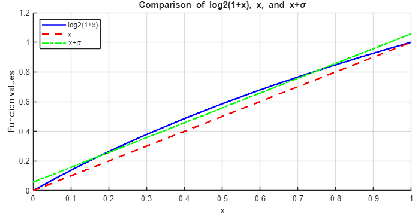
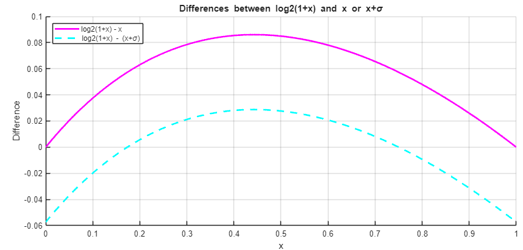
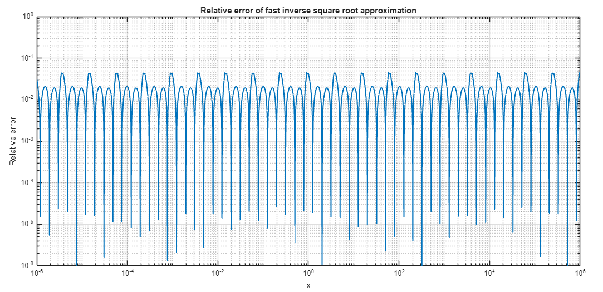
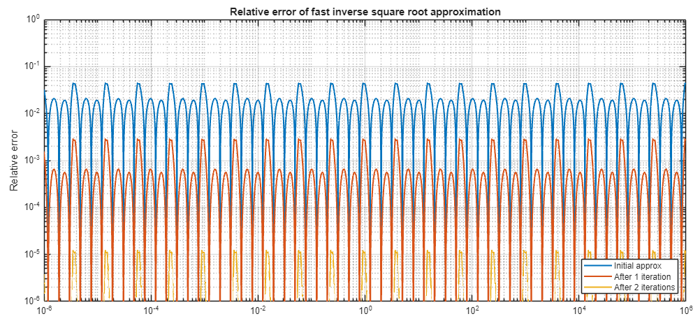

# Fast Negative Three-Half Exponent

As detailed in the body processing unit's documentation, the velocity update flow relies on computing $$x^{-3/2}$$. While it would be possible to implement the fast inverse square root algorithm (which computes $$x^{-1/2}$$) and then cube the result, a custom algorithm dedicated to $$x^{-3/2}$$ can yield better results, depending on the precision requirements.

This document first explains the well-known fast inverse square root algorithm, details the custom fast negative three-half exponent algorithm, and then compares the two methods in terms of precision and clock cycles necessary.

## The Fast Inverse Square Root Algorithm

The fast inverse square root algorithm is a well-known method for approximating $$y = 1/\sqrt(x)$$.

### Initial Estimate

Interpreting the bit representation of a positive IEE-754 floating point number $$x=(1+ \frac{M_x}{N} ) \cdot 2^{E_x-B}$$ as an integer thus results in: 
$$ \label{fAsInt}
	I_x = E_x \cdot N + M_x
$$
Where $$I_x$$ is the float interpreted as an integer, $E_x$ is the exponent of the floating point number, N is $$2^{23}$$ and $$M_x$$ is the mantissa. 

When looking for the inverse square root : 

$$
y=\frac{1}{\sqrt{x}}
$$

$$
\leftrightarrow \log_2(y) = -\frac{1}{2} \log_2(x)
$$

$$
\leftrightarrow \log_2\left((1 + \frac{M_y}{N}) \cdot 2^{E_y - B}\right) = -\frac{1}{2} \log_2\left((1 + \frac{M_x}{N}) \cdot 2^{E_x - B}\right)
$$

$$
\leftrightarrow \log_2(1 + \frac{M_y}{N}) + E_y - B = -\frac{1}{2} (\log_2(1 + \frac{M_x}{N}) + E_x - B)
$$

$$
\leftrightarrow \log_2(1 + \frac{M_y}{N}) + E_y = -\frac{1}{2} (\log_2(1 + \frac{M_x}{N}) + E_x) + \frac{3B}{2}
$$

Using the first order Taylor approximation, $$\log_2(1 + x) \approx x$$. For $$x$$ in $$[0, 1)$$, the overall error can be reduced by adding a bias term (see [1]):

$$
\label{log2Approx}
\log_2(1 + x) \approx x + \sigma
$$

To minimize the total error, `σ = 0.057304...`. This computation is detailed in [1].

> **Note:** Adding a small offset to the first order Taylor approximation allows for a closer fit in the range $$[0, 1)$$. While the absolute value of the error is higher at the end than at the start with the offset, the overall error is lower with the offset.

$$M_y/N$$ is in the range $$[0, 1)$$. Thus, the approximation can be injected into the previous equation yields:

$$
\frac{M_y}{N} + \sigma + E_y \approx -\frac{1}{2} (\frac{M_x}{N} + \sigma + E_x) + \frac{3B}{2}
$$

Or, grouping terms:

$$
\frac{M_y}{N} + E_y + \sigma \approx -\frac{1}{2} (\frac{M_x}{N} + E_x + \sigma) + \frac{3B}{2}
$$

$$
M_y + E_y N + N \sigma \approx -\frac{1}{2} (M_x + E_x N + N \sigma) + N \frac{3B}{2}
$$

$$
I_y + N \sigma \approx -\frac{1}{2} (I_x + N \sigma) + N \frac{3B}{2}
$$

$$
I_y \approx \frac{3N}{2} (B - \sigma) - \frac{I_x}{2}
$$

The term $$\frac{3N}{2} (B - \sigma)$$, often referred to as the "magic number", can take different values depending on the value of $$\sigma$$ used. For $$\sigma = 0.057304$$, $$\frac{3N}{2} (B - \sigma) = 1.5973087728 \cdot 10^9 = 0x5F34FF64$$.

Which yields:

$$
I_y \approx 0x5F34FF64 - (I_x \gg 1)
$$

Using this formula for the magic number yields the following result:

### Refining the Estimate

As shown in the last section, while the estimate has an overall good fit (with a relative error of around 4% in the worst cases), it can still be improved. To do so, the Newton-Raphson method is traditionally used [2]. The idea is to create a function that takes the estimate as input and has roots only where the estimate has the correct value, then use the Newton-Raphson method to refine the estimate of the root's position.

This is traditionally done as follows:

$$
f(y) = \frac{1}{y^2} - x
$$

$$
f'(y) = -\frac{2}{y^3}
$$
Using the Newton-Raphson method:
$$
y_{n+1} = y_n - \frac{f(y_n)}{f'(y_n)} = y_n - \frac{\frac{1}{y_n^2} - x}{-\frac{2}{y_n^3}} = y_n + \frac{y_n}{2} - x y_n^3 = y_n \left(\frac{3}{2} - x y_n^2\right)
$$

yields :

The results using this formula for one and two iterations of the refinement are shown below:

## The Fast Negative Three Half Algorithm

The proposed method is inspired from the inverse square root method, described above. As far as the author's knowledge goes, it is the first time such a method was proposed. This is likely because $$x^{-3/2}$$ can also be found by first computing $$x^{-1/2}$$ using the fast inverse square root method, and then multiplying $$x^{-1/2}$$ with itself three times. A comparison of the fast negative three half algorithm exponent and the fast inverse square root algorithm followed by two multiplications to obtain a similar result is presented at the end of the section.

Like the fast inverse square root, this method works by first computing a rough estimate of the result, then refining it using the Newton-Raphson method.

### Initial estimate

The initial estimate process is based on the same assumptions as the fast inverse square root method. As mentionned previously, the bit representation of a positive IEE-754 floating point number $$x=(1+ \frac{M_x}{N} ) \cdot 2^{E_x-B}$$ interpreted as an integer is equal to $$I_x = E_x \cdot N + M_x$$.
For two positive IEE-754 floating point numbers,  $$x=(1+ \frac{M_x}{N} ) \cdot 2^{E_x-B}$$ and  $$y=(1+ \frac{M_y}{N} ) \cdot 2^{E_y-B}$$:

$$
	y=\frac{1}{x^{3/2}}
$$

$$
	\leftrightarrow log_2 (y) = -\frac{3}{2} log_2(x)
$$

$$
	\leftrightarrow log_2 ((1+ \frac{M_y}{N}) \cdot 2^{E_y-B}) = -\frac{3}{2} log_2((1+ \frac{M_x}{N}) \cdot 2^{E_x-B})
$$

$$
	\leftrightarrow log_2 (1+  \frac{M_y}{N}) +  E_y-B = -\frac{3}{2} (log_2(1+ \frac{M_x}{N}) +E_x-B)
$$

$$ 
    \label{logFastNegThreeHalf}
	\leftrightarrow log_2 (1+  \frac{M_y}{N}) +  E_y = -\frac{3}{2} (log_2(1+ \frac{M_x}{N}) +E_x) + \frac{5B}{2} 
$$

Injecting equation approximation of log2 with bias correction, $$log_2 (1+x) \simeq x + \sigma $$, into the equation above, yields : 

$$
	\frac{M_y}{N} + \sigma +  E_y \simeq -\frac{3}{2} ( \frac{M_x}{N} + \sigma +E_x) + \frac{5B}{2} 
$$

As detailed previously, the bit representation of a positive IEE-754 floating point number $$x=(1+ \frac{M_x}{N} ) \cdot 2^{E_x-B}$$ interpreted as an integer is equal to $$I_x = E_x \cdot N + M_x$$. Placing $$I_x$$ and $$I_y$$ in evidence:

$$
	\leftrightarrow \frac{M_y}{N} +  E_y+ \sigma  \simeq -\frac{3}{2} ( \frac{M_x}{N} +E_x  + \sigma) + \frac{5B}{2} 
$$

$$
	\leftrightarrow \underbrace{M_y +  E_y \cdot N}_{I_y} + \sigma \cdot N \simeq -\frac{3}{2} ( \underbrace{M_x +  E_x \cdot N}_{I_x}  + \sigma \cdot N ) +  \frac{5B}{2}  \cdot N
$$

$$
	\leftrightarrow I_y + \sigma \cdot N  \simeq -\frac{3}{2}( I_x  +  \sigma \cdot N ) +  \frac{5B}{2} \cdot N
$$

$$
	\leftrightarrow I_y   \simeq  \frac{5N}{2} \cdot (B -  \sigma )  - \frac{3 I_x}{2}
$$

As before, a value of $$\sigma = 0.057304$$ is used to compute the "magic number", yielding:  $$  \frac{5N}{2} \cdot (B -  \sigma ) = 2.662181288\times10^{9} = 0x9EADA9A8$$

Compared to the fast inverse square root algorithm's first estimation, a times 3 multiplication appears, which makes the initial estimate slightly more costly:

$$
	I_y \simeq 0x5F2DA9A8 - ((3*I_x)>>1)
$$

### Refining the estimate
The fast inverse square root uses the Newton-Raphson method to refine the estimate. The Newton-Raphson is equivalent to the first order Householder's method. To refine the estimate of the result in the fast negative three half algorithm, multiple orders of the Householder's method were investigated. The main difficulty is to find the appropriate function on which to base this method, to avoid computationally costly refinement. The initial equation is:
$$
	y=x^{-3/2} \leftrightarrow y^2=x^{-3}
$$

From which many other equations can be written:

$$
	y=x^{-3/2} \leftrightarrow y^2=x^{-3} \leftrightarrow y^2x^3=1 \leftrightarrow y^{-2}x^{-3}=1 \leftrightarrow y^{4}x^{6}=1
$$

The Householder method is a root finding algorithm, where successive refinements of the approximated zero's position are made. It has the following expression:

$$
y_{n+1} = y_n + d \frac{(1/f)^{d-1} (y_n)}{(1/f)^d (y_n)}
$$

with $$y_n$$ the current estimation, and $$y_{n+1}$$ the refined estimation.

As it is a root finding algorithm, it is therefore necessary to find a function that has a root where the approximation meets the right value, and only there. The equations above can be modified to generate multiple functions that have a root where the estimation has the correct value:

$$
f(y) = - x^{9} + \frac{1}{y^{6}}, \quad f(y) = - x^{6} + \frac{1}{y^{4}}, \quad f(y) = - x^{3} + \frac{1}{y^{2}},
$$
or
$$
f(y) = y^{2} - \frac{1}{x^{3}}, \quad f(y) = y^{4} - \frac{1}{x^{6}}, \quad f(y) = y^{6} - \frac{1}{x^{9}}
$$

---

Placing all the different order of Householder's method with some of the possible equation in a table yields:

**Table: Comparison of different orders of Householder's method, based on multiple functions.**

| $$f(y)$$ | $$- x^{9} + \frac{1}{y^{6}}$$ | $$- x^{6} + \frac{1}{y^{4}}$$ | $$- x^{3} + \frac{1}{y^{2}}$$ | $$y^{2} - \frac{1}{x^{3}}$$ | $$y^{4} - \frac{1}{x^{6}}$$ | $$y^{6} - \frac{1}{x^{9}}$$ |
|:--|:--:|:--:|:--:|:--:|:--:|:--:|
| $$f'(y)$$ | $$- \frac{6}{y^{7}}$$ | $$- \frac{4}{y^{5}}$$ | $$- \frac{2}{y^{3}}$$ | $$2 y$$ | $$4 y^{3}$$ | $$6 y^{5}$$ |
| $$f''(y)$$ | $$\frac{42}{y^{8}}$$ | $$\frac{20}{y^{6}}$$ | $$\frac{6}{y^{4}}$$ | $$2$$ | $$12 y^{2}$$ | $$30 y^{4}$$ |
| $$y_{n+1}$$ (d=1) | $$\frac{y_n(- x^{9} y_n^{6} + 7)}{6}$$ | $$\frac{y_n(- x^{6} y_n^{4} + 5)}{4}$$ | $$\frac{y_n(- x^{3} y_n^{2} + 3)}{2}$$ | $$\frac{y_n}{2} + \frac{1}{2 x^{3} y_n}$$ | $$\frac{3 y_n}{4} + \frac{1}{4 x^{6} y_n^{3}}$$ | $$\frac{5 y_n}{6} + \frac{1}{6 x^{9} y_n^{5}}$$ |
| $$y_{n+1}$$ (d=2) | $$\frac{y_n(7 x^{18} y_n^{12} - 26 x^{9} y_n^{6} + 91)}{72}$$ | $$\frac{y_n(5 x^{12} y_n^{8} - 18 x^{6} y_n^{4} + 45)}{32}$$ | $$\frac{y_n(3 x^{6} y_n^{4} - 10 x^{3} y_n^{2} + 15)}{8}$$ | $$\frac{3 y_n}{8} + \frac{3}{4 x^{3} y_n} - \frac{1}{8 x^{6} y_n^{3}}$$ | $$\frac{21 y_n}{32} + \frac{7}{16 x^{6} y_n^{3}} - \frac{3}{32 x^{12} y_n^{7}}$$ | $$\frac{55 y_n}{72} + \frac{11}{36 x^{9} y_n^{5}} - \frac{5}{72 x^{18} y_n^{11}}$$ |
| $$y_{n+1}$$ (d=3) | $$\frac{y_n(- 21 x^{27} y_n^{18} + 77 x^{18} y_n^{12} - 115 x^{9} y_n^{6} + 203)}{144}$$ | $$\frac{y_n(- 95 x^{18} y_n^{12} + 345 x^{12} y_n^{8} - 501 x^{6} y_n^{4} + 635)}{384}$$ | $$\frac{y_n(- 11 x^{9} y_n^{6} + 39 x^{6} y_n^{4} - 53 x^{3} y_n^{2} + 41)}{16}$$ | $$\frac{13 y_n}{48} + \frac{17}{16 x^{3} y_n} - \frac{7}{16 x^{6} y_n^{3}} + \frac{5}{48 x^{9} y_n^{5}}$$ | $$\frac{71 x^{18} y_n^{12} + 95 x^{12} y_n^{8} - 51 x^{6} y_n^{4} + 13}{128 x^{18} y_n^{11}}$$ | $$\frac{295 x^{27} y_n^{18} + 237 x^{18} y_n^{12} - 135 x^{9} y_n^{6} + 35}{432 x^{27} y_n^{17}}$$ |

As an inversion would require an additional module, all the formulas that have an unknown in the denominator would not make a good choice. This directly disqualifies the results in the three columns at the right. The three columns on the left are similar, but  $$-x^3 + \frac{1}{y^2}$$'s row requires less exponents and is therefore less computationally intensive. Therefore, it was concluded that $$-x^3 + \frac{1}{y^2}$$ yields the best results. The equation for d=3 has large exponents that would place too much constraint on the range and was therefore not investigated.

The next subsection compares the remaining two refining formulas ($$-x^3 + \frac{1}{y^2}$$ for d = 1, 2) and the fast inverse square root algorithm to determine the best choice.

## Comparing the two methods

**Table: Comparison of the fast inverse square root and fast negative three half algorithms**

<table>
  <tr>
    <th rowspan="2">Method</th>
    <th colspan="4">Fast inverse square root initial estimate, cubed</th>
    <th colspan="6">Fast negative three half exponent</th>
  </tr>
  <tr>
    <th colspan="4">$$0x5F34FF64 - (I_x \gg 1)$$</th>
    <th colspan="6">$$0x5F2DA9A8 - ((3 \cdot I_x) \gg 1)$$</th>
  </tr>
  <tr>
    <td><strong>Refinement</strong></td>
    <td colspan="4">$$\frac{y (3 - x y^2)}{2}$$</td>
    <td colspan="4">$$\frac{y (3 - x^3 y^2)}{2}$$</td>
    <td colspan="2">$$\frac{y \left(3x^6 y^4 - 10x^3 y^2 + 15\right)}{8}$$</td>
  </tr>
  <tr>
    <td><strong>Number of refining iterations</strong></td>
    <td>0</td><td>1</td><td>2</td><td>3</td>
    <td>0</td><td>1</td><td>2</td><td>3</td><td>1</td><td>2</td>
  </tr>
  <tr>
    <td><strong>Cost (cycles)</strong></td>
    <td>3</td><td>8</td><td>12</td><td>16</td>
    <td>1</td><td>7</td><td>11</td><td>15</td><td>12</td><td>20</td>
  </tr>
  <tr>
    <td><strong>Average relative error</strong></td>
    <td>0.0504</td><td>0.0018</td><td>4.1826e-06</td><td>3.6510e-08</td>
    <td>0.0343</td><td>0.0026</td><td>2.1075e-05</td><td>3.7428e-08</td>
    <td>2.5527e-04</td><td>4.7846e-08</td>
  </tr>
</table>

The cost is approximated assuming 1 cycle for each addition or multiplication, no parallelism, but assuming data re use (for $$x^3$$, $$x^6$$). The division by two of an integer is not considered as a full clock cycle, as it can be done by shifting the bits. The average relative error was computed using Matlab, for 10 000 logarithmically spaced numbers ranging from $$10^{-6}$$ to $$10^{6}$$.

The table showcases that Householder's method with d=2 has a very poor cycle/precision ratio, which, in addition to its narrow range due to the use of $$x^6$$, makes it irrelevant. The true competition is between a cubed version of the fast inverse square root and the introduced fast negative three half exponent refined using the second order function. 

As the simulated systems can show chaotic behaviours, a good precision is crucial to ensure the accuracy of the result. Based on this observation, an arbitrary threshold of 1e-6 relative error was chosen. This leaves two possibilities, 3 iterations of fast inverse square root, or 3 iterations of fast negative three half exponent.
The second option requires 1 cycle less (around a 7% improvement), but a degradation of the relative precision of around 2.5 %. As the cycle count improvement is two times larger than the degradation in precision, the fast negative three half exponent with 3 iterations of refinement using Householder's method with d=1 (equivalent to the Newton-Raphson method) was used for the velocity update flow.

## References

1. McEniry, C. (2007). *The mathematics behind the fast inverse square root function code*.
2. Moroz, L. V., Walczyk, C. J., Hrynchyshyn, A., Holimath, V., & Cieśliński, J. L. (2018). Fast calculation of inverse square root with the use of magic constant – analytical approach. *Applied mathematics and computation*, 316, 245-255.