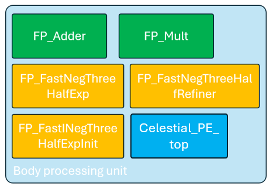

# Body processing unit

The body processing unit (BPU) is the core computational element of the celestial accelerator. Each unit is responsible for managing one celestial body and performing all necessary calculations for that body's motion and interactions.

## Main functions

The processing unit performs three primary tasks:

1. **Position update**: Calculate new position based on current velocity and time step
2. **Data output**: Provide position or velocity data to other units
3. **Velocity update**: Compute new velocity based on gravitational interactions
4. **Accepting input data**: Store the input data, such as coordinates of the celestial body

## Architecture overview

Each object processing unit contains four main sub-modules:

- A master module, which holds the position, velocity, mass and size. This master module orchestrates all the other sub modules to execute the requested tasks.
- A floating point adder / subtracter, which is necessary for vector operations and for the fast negative three half exponent.
- A floating point multiplier, which is necessary for vector operations and for the fast negative three half exponent.
- A fast negative three half exponent, which is necessary to update the velocity of the object.

 The first task, the position update, is straightforward, requiring only 3 multiplication and additions:

$$
\begin{cases}
x_{n+1} = x_t + dt \cdot v_{x,n} \\
y_{n+1} = y_t + dt \cdot v_{y,n} \\
z_{n+1} = z_t + dt \cdot v_{z,n}
\end{cases}
$$

    
    <em>Figure 1: The sub modules inside the body processing unit</em>

Since the adder/subtracter and multiplier modules can be used in parallel, the position update can be computed in four cycles: at the first cycle, the time step and X velocity are multiplied and the result is stored in a register acting as buffer. At the second step, the result in this buffer is added to the position in X. At the same cycle, the Y velocity is multiplied with the time step, and the result is stored in the buffer. The same process is then repeated for the Z axis. In total, this process thus takes 4 cycles.

The second task, the output selection according to the slct signal, can be done using a simple mux. The third task, however, requires more computation, as the normalised direction vector from one celestial body to another must be computed. It can be observed that the weight of the body who's velocity is updated can be simplified out of the equation, as shown in equation below:

$$
\vec{v}_{1,n+1} = \vec{v}_{1,n} +  dt \cdot \frac{m_1 \cdot m_2 \cdot G \cdot \frac{\vec{1}_d}{||\vec{d}||^2}}{m_1} =  \vec{v}_{1,n} +  dt \cdot m_2 \cdot G \cdot \frac{\vec{1}_d}{||\vec{d}||^2}
$$

 There a numerous ways to implement this. A simple implementation could use the fast inverse square root algorithm, detailed in appendix, and multiply the result it with the non normalised direction vector to compute the normalised vector. To compute $1/||d||^2$, the output of the fast inverse square root, $1/d$, can be multiplied with itself to avoid adding an inverter module. To avoid redundant computations, the stored mass is pre scaled with G. The resulting flow is shown in Figure 2:

    
     
    <em>Figure 2: A relatively naive implementation of the velocity update. It assumes that the stored mass is already pre scaled with the gravitational constant, G, to save a cycle. Additionally, it is assume that the fast inverse square root algorithm uses 3 refining cycles.</em>

This is not optimal, as the dependencies between the data lead to more computation cycles than necessary. The critical path, shown in red, requires 30 operations (assuming the inverse square root is refined 3 times, as detailed in the performance analysis). The total number of operation is 32.

This can be significantly improved by modifying the flow. It can be observed that the computation of the normalised direction vector can be skipped entirely by modifying further the velocity update equation, as detailed in equation below:

$$
\vec{v}_{1,n+1} = \vec{v}_{1,n} + m_2 \cdot G \cdot \frac{\vec{1}_d}{||\vec{d}||^2} =  \vec{v}_{1,n} + m_2 \cdot G \cdot \frac{\vec{d}}{||\vec{d}||^3}
$$
 
 
 With $\vec{d}$ the non normalised direction vector. $||\vec{d}||^3$ is computed using a custom made algorithm, detailed in the fast negative three half exponent documentation. The flow then becomes:

    
     
    <em>Figure 3: An improved implementation of the velocity update. This assumes 3 refinement cycles for the fast neg three half algorithm.</em>

 
 
 The critical path, in red, now takes 26 cycles. The total number of cycles is brought down from 32 to 27. Some of the computation can be made in parallel to use the two arithmetic modules at once, which allows the whole update process to take only 23 cycles, including the collision detection and addition of the result to the current velocity, which are not shown on the figure above for simplicity. The repartition of each of the different unit at each cycle is detailed in the table below:

    
     
    <em>Figure 4: How the different sub modules are used at each cycle of the velocity update</em>

The adder module also serves as subtracter module, depending on its input signal. During the cycles 0 to 2, the sub module is used to compute $\vec{d}$. From cycle 1 to 3, the multiplication module is used to multiply the components of $\vec{d}$ with themselves, to compute $||\vec{d}||^2$.

From cycle 3 to 4, the adder module adds the outputs of the multiplication module, to finalise the computation of $||\vec{d}||^2$. Its output is forwarded at the same cycle to the fastNegExp module, which directly starts the computation of the initial estimate using the multiplication module. At the cycle 6, the adder adds the sizes of the two bodies, which is used later to detect collisions.

At the cycle 8, the refinement module of the negative three half exponent method doesn't use the multiplication module, which is therefore used by the top module to compute $\hat{m}_2*dt$. The same goes for cycle 11, where the addition of the two body sizes is multiplied with itself. This is then compared with $||\vec{d}||^2$ by the top module, to detect potential collisions.

While comparing $||\vec{d}||$ to the sum of the size of the two celestial bodies is more intuitive, the detection collision detection is done by comparing $||\vec{d}||^2$ to $(s_1 + s_2)^2$ instead, with $s_1$ and $s_2$ the size of the first and second body respectively. It is done this way because the actual distance ($||\vec{d}||$) is never computed, only its squared value.

At cycle 18, the multiplier module computes $dt\cdot \frac{\hat{m}_2}{||\vec{d}||^3}$. This value is then multiplied with each of the components of $\vec{d}$ at cycle 18 to 20, and the result is added to the current velocity from cycle 20 to 22.
